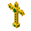

Simple Relics adds mystical relics that trigger powerful effects during gameplay.

Relics activate automatically when certain conditions happen (such as taking damage), creating clutch moments during combat.

### How It Works

• Relics must be equipped in the **Utility / Off-hand slot**  
• When triggered, the relic activates its special effect  
• Relics are **consumed on activation**

### Relic Fatigue

After a relic activates, the player gains **Relic Fatigue** for a short duration.

While affected by Relic Fatigue:

• No relic can activate  
• A visual status effect appears to indicate the fatigue

This prevents relic spam and keeps relic activations meaningful.

### Current Relics

**Emerald Cross**  
Avoids user death and apply health regen effect.

**Lucky Horseshoe**  
Negates fall damage (never consumes)

**Vampiric Relic**  
Restores health based on enemies health around you.

More relics may be added in future updates.

### Design Philosophy

Simple Relics is designed to be:

• Lightweight  
• Easy to understand  
• Balanced for vanilla-style gameplay

Relics are meant to be **situational tools**, not permanent buffs.